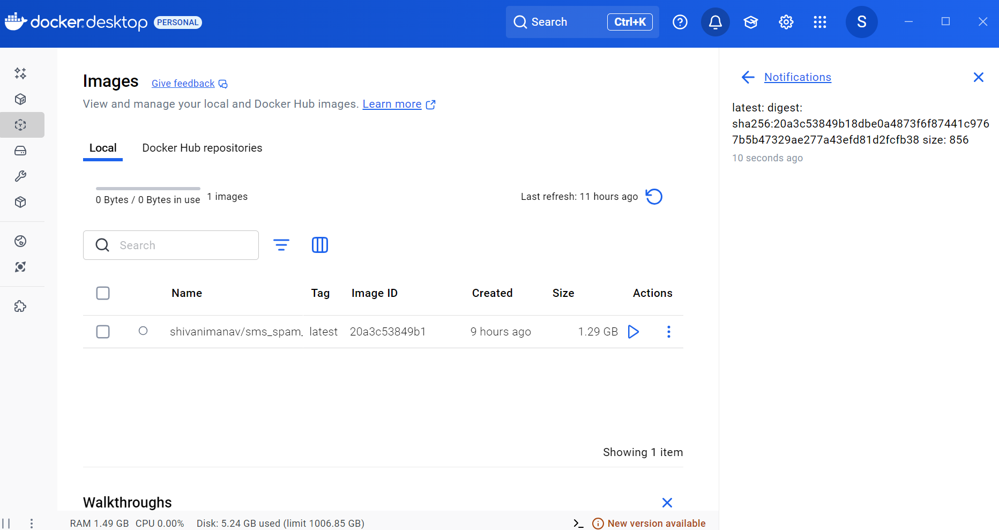
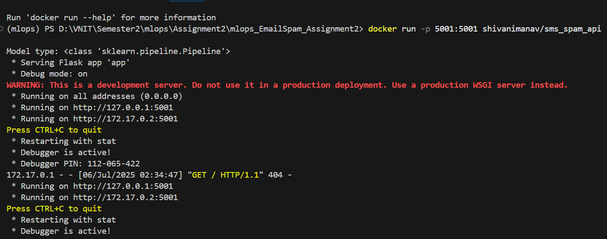
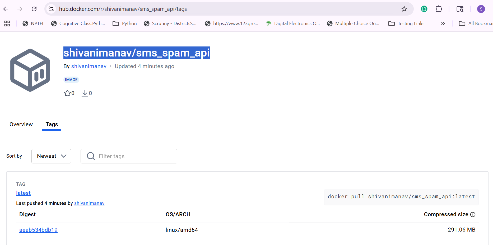
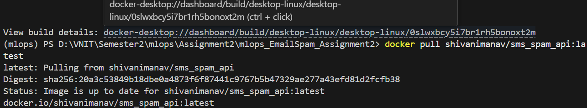
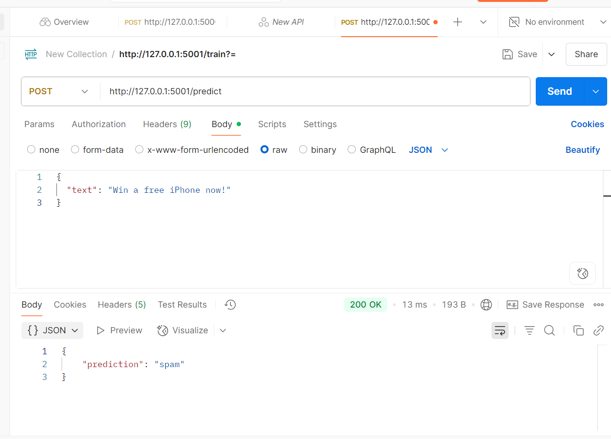
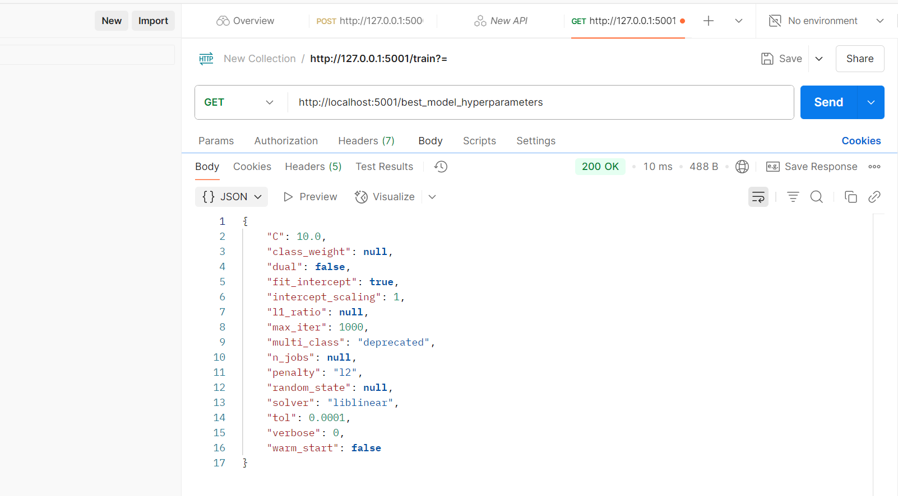

# mlops_SmsSpam_Assignment2
SMS Spam Detection using ML, Flask, and Docker

1. [Docker Hub Repository]  Docker Hub Link
2. [Steps to Accomplish Tasks]

   

# 1. Docker Hub Link

**Docker Image:**  
https://hub.docker.com/r/vishwajeetyadav3597/sms_spam_api

```bash
# Pull the image
docker pull vishwajeetyadav3597/sms_spam_api:latest

# Run the container
docker run -p 5001:5001 vishwajeetyadav3597/sms_spam_api

/prediction
Request Type: POST
URL: http://127.0.0.1:5001/prediction

Sample Request Body:
{
  "text": "Congratulations! You've won a $1,000 gift card. Claim now: http:claimprize.com"
}

/training
Request Type: POST
URL: http://127.0.0.1:5001/training

Sample Request Body:
{
  "C": 0.4,
  "max_iter": 250,
  "solver": "liblinear"
}

/best_model_parameter
Request Type: GET
URL: http://127.0.0.1:5001/best_model_parameter

Request Body: Not required
```
********************************************************************


# 2. **Steps to Accomplish Tasks**
 
##  Email Spam Classifier with Flask API & Docker Deployment

###  Model Training Approaches

-   **Multinomial Naive Bayes** with `TfidfVectorizer`
-   **Logistic Regression** with `CountVectorizer`  *(Selected)*

**Evaluation Metrics**: Accuracy, Precision, Recall, F1-Score, ROC-AUC  
**Selected Combination**: `LogisticRegression + CountVectorizer`  
**Key Files**: `logisticreg.py`, `main.py`

---

##  API Endpoints (Flask REST API)

A lightweight RESTful API to classify SMS messages as **Spam** or **Not Spam**.

### POST `/prediction`
- **Description**: Predict SMS spam/not spam  
- **Input**: JSON `{ "text": "your message" }`  
- **Response**: JSON `{ "prediction": "spam" | "not spam" }`  

###  GET `/best_model_parameter`
- **Description**: Returns best parameters (from Grid/RandomizedSearchCV)  
- **Response**: JSON of hyperparameters  

###  POST `/training`
- **Description**: Trains model using predefined dataset path  
- **Note**: Dataset path is hardcoded in script

- **Input**: JSON `{  "C": 0.4,  "max_iter": 250,  "solver": "liblinear"}`
- **Response**: JSON `{"message": "Model retrained using Logistic Regression."}`

---


### Build Docker Image
```bash
- docker build -t dockerhub_username/sms_spam_api .
```


## RUN the container from image
```bash
- docker run -p 5001:5001 dockerhub_username/sms_spam_api
```



## PUSH to Docker Hub
```bash
- docker push dockerhub_username/sms_spam_api
```



## PULL and RUN FROM Docker Hub
```bash
- docker pull dockerhub_username/sms_spam_api
- docker run -p 5001:5001 dockerhub_username/sms_spam_api
```



##  Dockerized Deployment
## Screenshot to Predict

## Screenshot to Best HyperParameter



